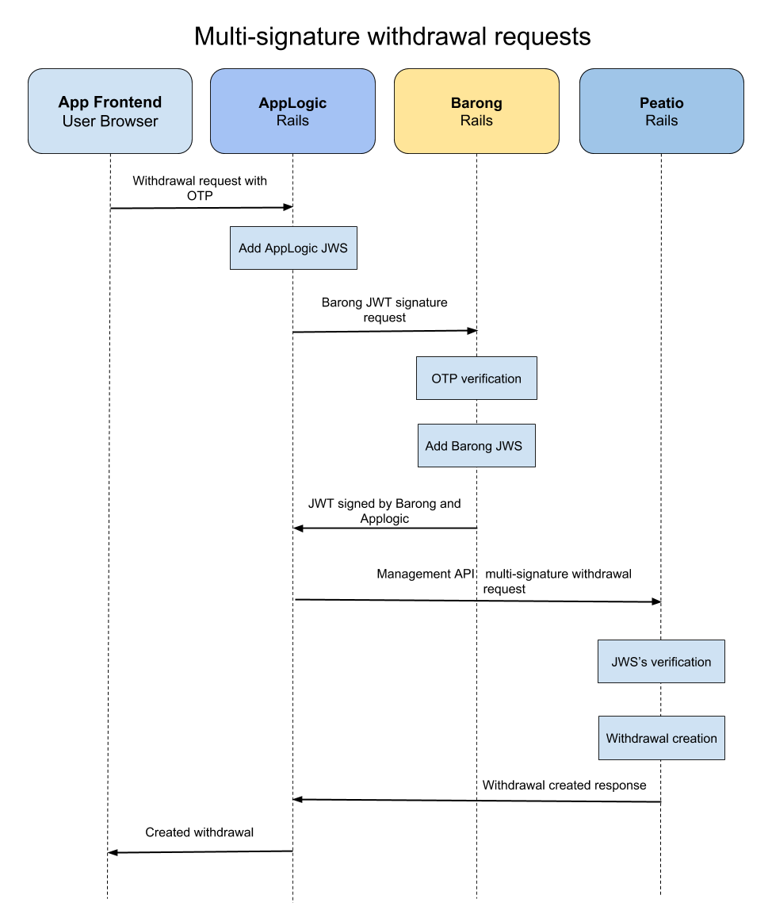

# AppLogic

AppLogic is the component for implementitng custom business processes which should be separeated from core Peatio and Barong functionality.

## Getting Started

### Minimalistic local development environment with docker-compose:

#### Prerequisites
* [Docker](https://docs.docker.com/install/) installed
* [Docker compose](https://docs.docker.com/compose/install/) installed
* Ruby 2.5.0
* Rails 5.2+

#### Installation

1. Copy initial configurations `./bin/init_config`
2. Start backend services (MySQL, RabbitMQ) `docker-compose -f config/backend.yml up -d`
3. Setup database `rake db:create db:migrate db:seed`
4. Start rails server `rails server`

## Features

* [Multisignature withdrawal request using Management API](#multisignature-withdrawa-request-using-management-api)
* [Custom Event API listeners](docs/using_event_api.md)

### Multisignature withdrawal request using Management API

