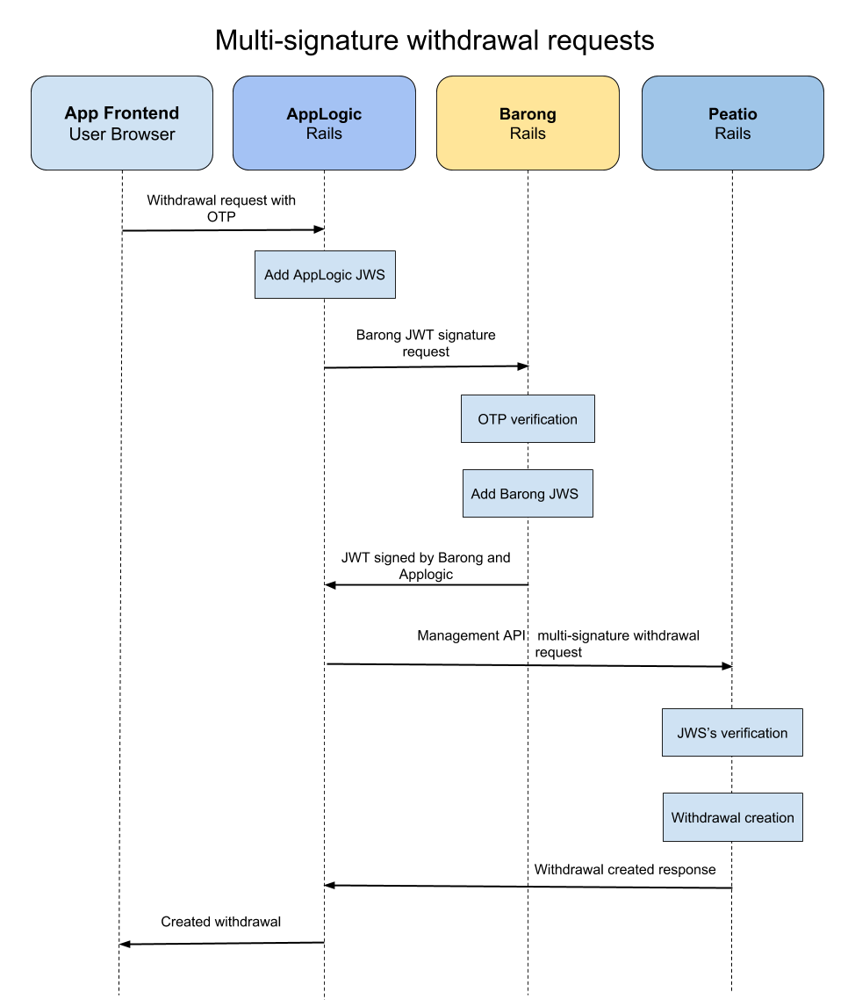
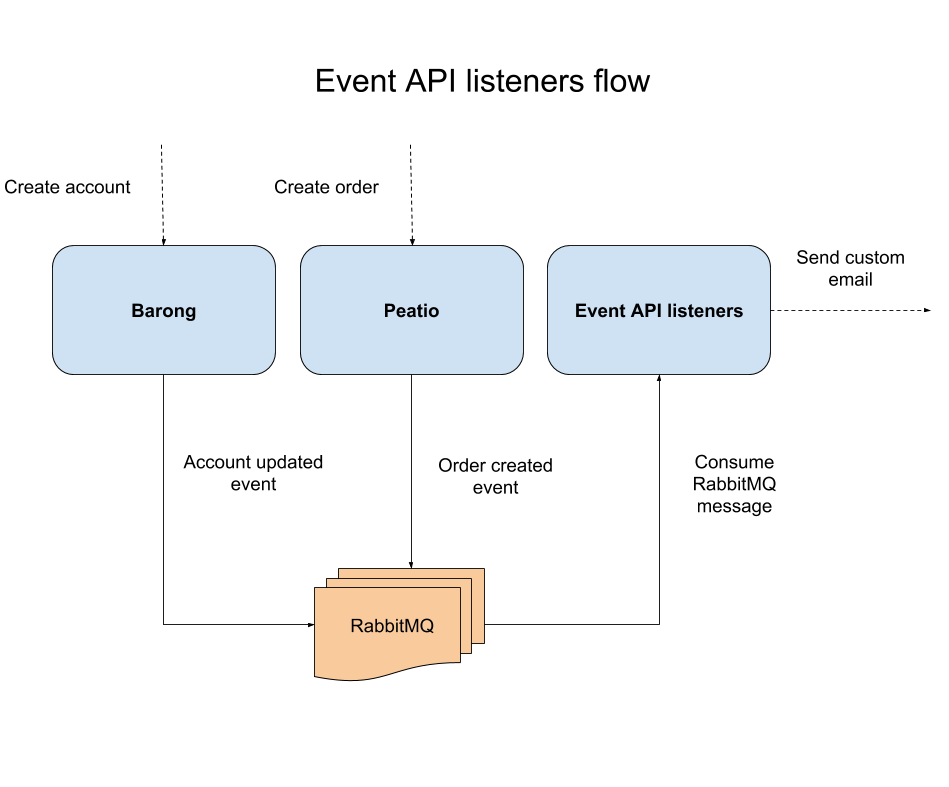

# AppLogic

AppLogic is the component for implementing custom business processes which is currently being separated from core Peatio and Barong functionality. It is also designed for extending the system's functionality, for example adding a Paygate or a custom AML provider and is used by frontend application as well.

## Getting Started

We advise to use [minimalistic environment](#minimalistic-local-development-environment-with-docker-compose) if you want to develop AppLogic.  

### Minimalistic local development environment with docker-compose:

#### Prerequisites
* [Docker](https://docs.docker.com/install/) installed
* [Docker compose](https://docs.docker.com/compose/install/) installed
* Ruby 2.5.0
* Rails 5.2+

#### Installation

1. Copy initial configurations `./bin/init_config`
2. Start backend services (MySQL, RabbitMQ) `docker-compose -f config/backend.yml up -d`
3. Setup database `rake db:create db:migrate db:seed`
4. Start rails server `rails server`

#### Interaction with other components

AppLogic interacts with other components using Event API and Management API. You will find examples in [features](#features) section.

## Features

Among the main AppLogic features there are:

* [Multisignature withdrawal request using Management API](#multisignature-withdrawal-request-using-management-api)
* [Custom Event API listeners](#custom-event-api-listeners)

### Multisignature withdrawal request using Management API

### Custom Event API listeners

Detailed documentation about implementation of Event API listeners could be found [here](doc/examples/using_event_api.md).
